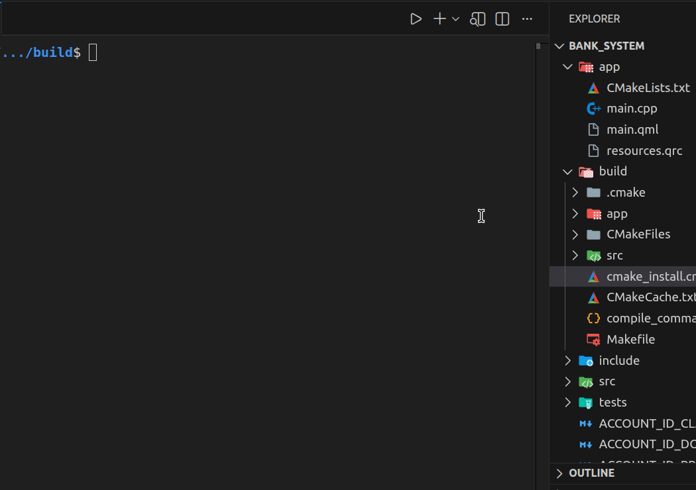

# GUI  Bank System 🏦

A simple cross-platform bank management application with a Qt/QML GUI and a C++ backend. The project provides account creation, balance operations (deposit/withdraw), account details, search, JSON persistence, and a CLI for automation and testing.

---
## 🎞️ GIF Demo
- Demo GUI


## Key features ✅

- GUI built with Qt6/QML for a responsive UI experience
- C++17 backend with clear separation: `Bank`, `Account`, and `JsonPersistence`
- JSON persistence using `nlohmann::json`
- CLI for scripting and manual testing
- Unit tests using Catch2
- QML UI includes hover/pressed visual states and animated transitions for buttons

---

## Repo structure

- `app/` — QML UI, resources, sample `accounts.json`
- `src/` — C++ source code (bank, persistence, bridge, CLI)
- `include/` — public headers for core interfaces and models
- `tests/` — unit tests (Catch2)
- `CMakeLists.txt` — root CMake configuration

---

## Prerequisites

Install required development packages (example for Debian/Ubuntu):

```bash
sudo apt update
sudo apt install build-essential cmake qt6-base-dev qt6-declarative-dev qt6quickcontrols2-dev libqt6quickcontrols2-6
```

Make sure you have a C++ compiler that supports C++17 and CMake 3.16+.

---

## Build (Linux / generic)

From the repository root:

```bash
mkdir -p build
cd build
cmake .. -DCMAKE_BUILD_TYPE=Release
cmake --build . -j$(nproc)
```

---

## Run

- GUI:

```bash
./app/bank_system
```

Logs and QML runtime messages are written to `/tmp/bank_system.log` when launched from the build directory. If the GUI fails to start because of a QML syntax problem, run:

```bash
qmllint app/main.qml
tail -n 200 /tmp/bank_system.log
```

- CLI (from build directory):

```bash
./cli/cli
```

---

## Testing

Run unit tests from the build directory:

```bash
ctest --output-on-failure -j$(nproc)
```

Or run the test binary directly (located under `tests/` if built).

---

## Usage notes

- Accounts use sequential integer IDs (1, 2, 3, ...). The QML UI displays these IDs after account creation.
- Persistence is stored in `app/accounts.json` as `accountId` → account object.
- If you see missing hover/pressed effects or QML binding errors, inspect `/tmp/bank_system.log` and run `qmllint` as noted above.

---

## Contributing

1. Fork the repo and create a feature branch
2. Add/modify unit tests where appropriate
3. Open a Pull Request with a clear description and test coverage

Please add an appropriate `LICENSE` file (MIT is a good choice) if you plan to open-source this project publicly.

---

## License

This repository does not include a license file by default. Add a `LICENSE` (for example, MIT) to make the project open-source.

---

If you'd like, I can also: add a `CONTRIBUTING.md`, include example CLI commands in the README, or add a screenshot for the GUI. Which would you prefer next? 💡
